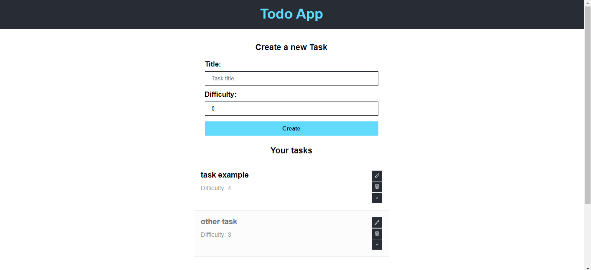

<h1 align='center'>Todo App</h1>

<p align="center">
  <a href="#-sobre">Sobre</a>&nbsp;&nbsp;&nbsp;|&nbsp;&nbsp;&nbsp;
  <a href="#-layout">Layout</a>&nbsp;&nbsp;&nbsp;|&nbsp;&nbsp;&nbsp;
  <a href="#-funcionalidades">Funcionalidades</a>&nbsp;&nbsp;&nbsp;|&nbsp;&nbsp;&nbsp;
  <a href="#-tecnologias-e-ferramentas">Tecnologias e Ferramentas</a>&nbsp;&nbsp;&nbsp;|&nbsp;&nbsp;&nbsp;
  <a href="#-como-usar">Como usar</a>&nbsp;&nbsp;&nbsp;|&nbsp;&nbsp;&nbsp;
  <a href="#-licença">Licença</a>&nbsp;&nbsp;&nbsp;|&nbsp;&nbsp;&nbsp;
</p>


<hr/>


## ❓ Sobre

Este projeto é uma aplicação React de lista de tarefas.  

<!-- Clique [aqui](https://reactgram-4yia.onrender.com/) para conferir como ficou a aplicação hospedada na plataforma [Render](https://render.com/).   -->


## 🎨 Layout




## ⚙️ Funcionalidades

- [x] Gerenciamento de tarefas
- [x] Completar e descompletar tarefas
- [x] Exibir tarefas 


## 🛠 Tecnologias e Ferramentas

- [ReactJS](https://react.dev/)
- [React Icons](https://www.npmjs.com/package/react-icons)
- [TypeScript](https://www.typescriptlang.org/)
- [Vite](https://vitejs.dev/)
- [Visual Studio Code](https://code.visualstudio.com/)

Confira melhor as dependências do projeto clicando [aqui](./package.json). 


## 💻 Como usar

Antes de continuar, é recomendado possuir alguns conhecimentos básicos de [HTML5](https://developer.mozilla.org/pt-BR/docs/Web/HTML), [CSS3](https://developer.mozilla.org/pt-BR/docs/Web/HTML), [JavaScript](https://www.javascript.com/), [Node.js](https://nodejs.org/docs/latest/api/) e [ReactJS](https://react.dev/) para entender os códigos do projeto. 
Além disso, você precisa ter instalado em sua máquina o [GIT](https://git-scm.com/), [Node](https://nodejs.org/en) e um **editor de texto** de sua preferência. Recomendo sempre utilizar o [Visual Studio Code](https://code.visualstudio.com/). 

Um guia básico sobre como instalar e executar o projeto em modo de desenvolvimento na sua máquina local: 

1. Clone o projeto ou faça download do ZIP: 

```bash
    # abra o terminal (Git Bash de preferência) e digite 
    # não precisa fazer isso se já tiver feito download do projeto (nesse caso, só extraia a pasta e entre nela)
    $ git clone https://github.com/Gustavo-Victor/todo-app.git
```

2. Entre na pasta do projeto:

```bash
    $ cd todo-app/
```

3. Instalar as dependências do projeto: 

```bash
    $ npm install
```

4. Executar o projeto em modo de desenvolvimento:

```bash
    $ npm run dev
``` 

5. Abra o projeto no seu navegador de preferência:
    - Digite no seu navegador o URL: http://localhost:5173/

<hr/>


## 📝 Licença 

O projeto está sob a Licensa MIT 

Qualquer pessoa pode usar, clonar e contribuir com este projeto. 

Clique [aqui](./LICENSE) para saber mais  


